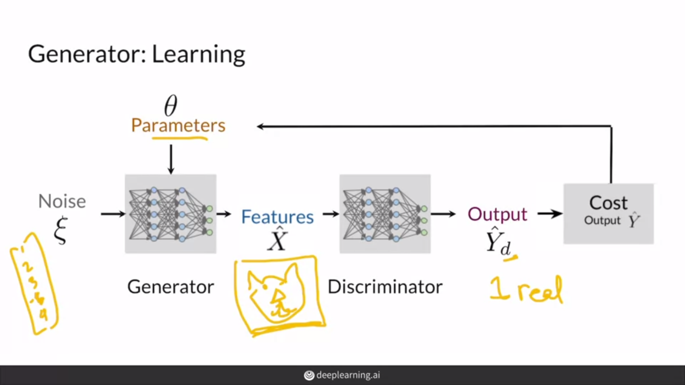

# Generative Adversarial Networks

## Whats Gans?
In the auto encoder section , we got the concept of auto encoder and VAE , Now I want to talk about Gans, In the Gans we have two part ,**Generator** and **Discriminator**

### Generator 
Generator is like a decoder in the VAE and try to generate some random number (fake data) and fool the discriminator , its learning to make a better fake data

### Discriminator 
This is part is reponsible to figure ou what image is fake or real , Its a classifier 

It calls adversarial because these two part are fighting and want to decieve each other ,

