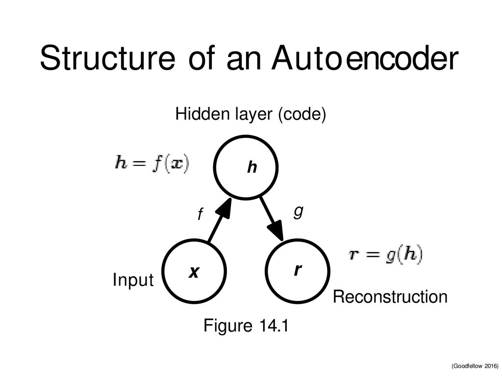

# Deep Auto Encoder

### We want point these topics earlier:

- [Overview](#what-is-the-auto-encoder)
- [how it works](#how)
- [Loss Function](#loss)

## what is the auto encoder
I want to mention some sentence of hero of DL :

An Autoencoder is a neural network that is trained to attemp to copy its input to its output (<small>**lan goodfellow**</small>)

Autoencoders are artificial neural networks, trained in an unsupervised manner, that aim to first learn encoded representations of our data and then generate the input data (as closely as possible) from the learned encoded representations. Thus, the output of an autoencoder is its prediction for the input. (<small>**Yan lecuu**</small>)

As you read , This is **unsupervised learning**


## <span id="how">How it works?</span>
We have two parts : <br/>
- First part is encoder function like : ``` h=F(x)```
- second part is decoder that reconstruct ``` r=g(h) ```



One of the usage of this concept is extract features and convert to the smaller dimension than input ,So We call it **undercomplete** , in due to we have less code dimension than input dimension for example : For Credit Card Fraud Detection . <br />

we have another type as name **overcomplete** that has larger dimension from input size , for example for : Generate Fake humans


## <span id="loss"> Loss Function </span>
In general we use this for our dataset for average the loss of samples 
$$ L = \frac{1}{m} \sum_{j=1}^m \ell(x^{(j)},\hat{x}^{(j)}) $$

For calculate reconstruction loss we use

$$ \ell(\boldsymbol{x},\boldsymbol{\hat{x}}) = \frac{1}{2} \lVert \boldsymbol{x} - \boldsymbol{\hat{x}} \rVert^2 $$

we check differnce between main input and genrated output . <br />

I wanted to recap shortly auto encoder concept , Certainly There are more than I wrote , so please keep going to study more .

Resources : 
[Deep learning lan goodfellow](https://www.deeplearningbook.org/) , [yann lecun NYU](https://atcold.github.io/pytorch-Deep-Learning/), [Deep learning wizard](https://www.deeplearningwizard.com/) , [MIT course](https://www.youtube.com/watch?v=BUNl0To1IVw&list=PLtBw6njQRU-rwp5__7C0oIVt26ZgjG9NI&index=4)

You can check [mnist auto encoder](https://github.com/tmohammad78/deep-learning-projects/blob/main/deep_auto_encoder/Mnist%20auto%20encoder.ipynb) and [cnn auto encoder](https://github.com/tmohammad78/deep-learning-projects/tree/main/deep_auto_encoder_cnn) despite , There are many samples 