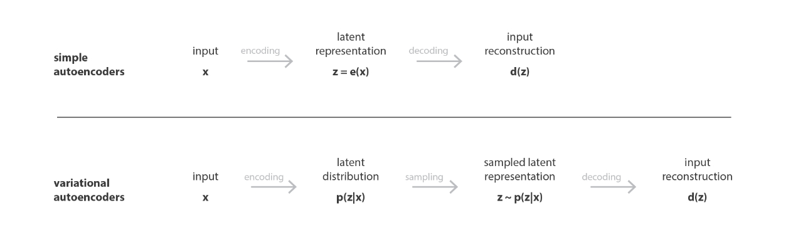
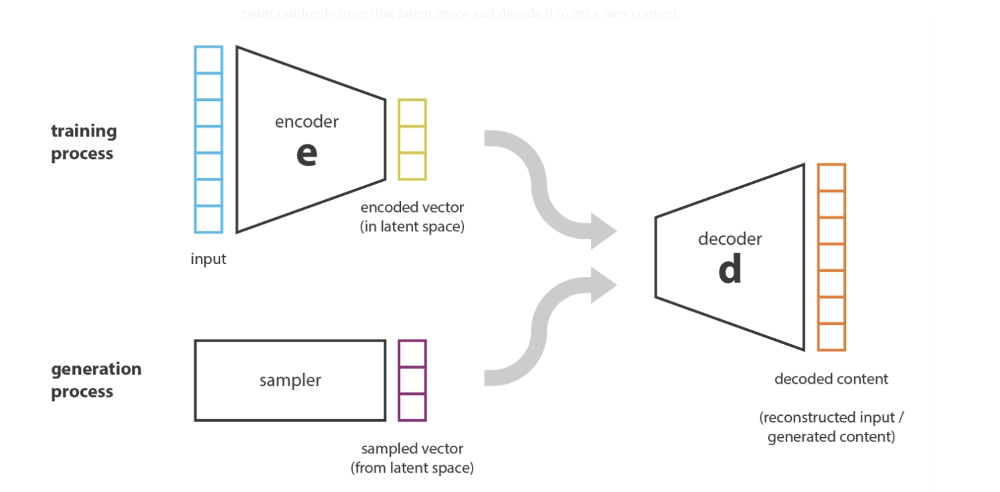
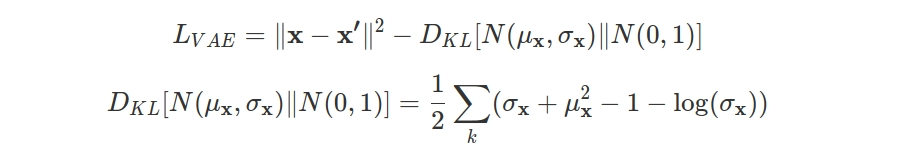
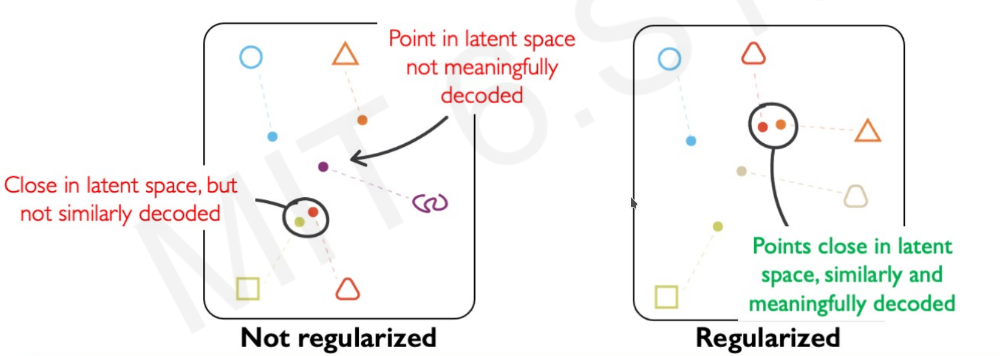
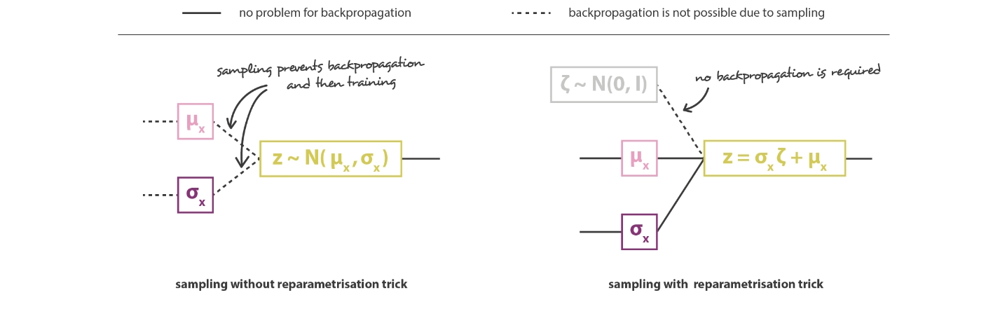
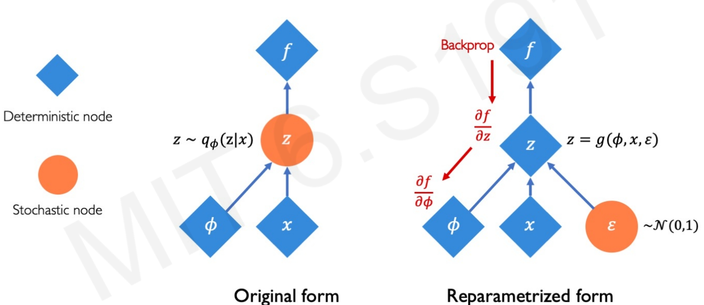

# Variational Auto Encoder

- [Variational Auto Encoder](#variational-auto-encoder)
  - [The Problem of AutoEncoder](#the-problem-of-autoencoder)
  - [what is the variational auto encoder](#what-is-the-variational-auto-encoder)
  - [Loss function](#loss-function)
  - [But what things we want from regularization ?](#but-what-things-we-want-from-regularization-)
  - [How backpropagate](#how-backpropagate)
  - [Implement](#implement)

## The Problem of AutoEncoder

In the past step I sayed about [auto encoder](https://github.com/tmohammad78/deep-learning-projects/tree/main/deep_auto_encoder) shortly and in this step we want to take a look in the variational auto encoder .

We got that there is a bottleneck layer in the middle of encoder and decoder , and this layer help us to learn **latent space** or **z** , This middle layer is just a simple hidden layer in the AE , we saw the loss function of it , It's difference of output and input sample .

In the auto encoder we had limitation for generating data , We have no real generated content and the vector of latent space is fixed but in the VAE we want to input sample data and generate new items , actully we want get randomly from the latent space and decode it and generate new content , but it depends on the reqularity of latent space and latent space depends on the distribution of the initial data and the dimension of the latent space and the architecture of the encoder of the latent space .

## what is the variational auto encoder

It's an autoencoder whose training is regularized to avoid overfitting and ensure that the latent space has good properties that enable generative process. The idea is instead of mapping the input into a fixed vector, we want to map it into a distribution.

In the VAE we add two item to our latent space: 
1) Mean  
2) standard deviation 

## Loss function

In the VAE loss function we have two parts : One part is **reconstruction loss** and second is **regularization loss** , The first part is equal to AE , we check difference , but in the second part we , which regularizes the latent space by making the distributions returned by the encoder close to a standard normal distribution , [Kullback–Leibler divergence](https://en.wikipedia.org/wiki/Kullback%E2%80%93Leibler_divergence) used in the second part , we want check difference between returned distribution and the normal distribution(gussian) .

## But what things we want from regularization ?

1) **Continuity** : Points that are close in the latent space (similar content after decoding )
2) **Completense** : samping from latent space (meaningful content after decoding)

## How backpropagate
In the middle layer , Z has a distribution of N(μ,σ).
Since Sampling is a stochastic process, we cannot backpropagate the gradient while training the model . 
so if we want to make model trainable we change it to :
  **z=μ+σ⊙ϵ**  
We add **μ** and  **σ** as fixed vector and we scaled by random constant , We called it reparametrization trick

  
<small>* ⊙ is the element-wise multiplication.</small> 

## Implement
For implementing we split our code to encoder and decoder 
and also latent space , We got that latent space is 
`Z = mean + sigma * epsilo` .  
For calculate sigma we write in this shape `sigma = tf.exp(0.5 * z_log_v)` , You see that we use log of variance not standard deviation directly , for more detail you can check this link [log variance](https://stats.stackexchange.com/questions/486203/why-we-learn-log-sigma2-in-vae-reparameterization-trick-instead-of-standar?newreg=b3630e5f1932420788dc2d1b6ff3ad43) and [reparameterization](https://towardsdatascience.com/reparameterization-trick-126062cfd3c3) .

 After all we know create decoder and encoder , we use `tf.keras.layers.Conv2` that used for convolution 
 <small>Resources :</small> [<small> VAE and AE Meduim</small>](https://towardsdatascience.com/understanding-variational-autoencoders-vaes-f70510919f73) , [<small>Tutorial</small>](https://sci2lab.github.io/ml_tutorial/autoencoder/#), [<small>From AuoEncoder to Beta-VAE</small>](https://lilianweng.github.io/lil-log/2018/08/12/from-autoencoder-to-beta-vae.html) , [<small>MIT course</small>](https://www.youtube.com/watch?v=BUNl0To1IVw&list=PLtBw6njQRU-rwp5__7C0oIVt26ZgjG9NI&index=4)

You can check [mnist VAE](https://github.com/tmohammad78/deep-learning-projects/blob/main/variational-autoencoder/mode.ipynb) and better version is [Mnits](https://github.com/tmohammad78/deep-learning-projects/blob/main/variational-autoencoder/mnist-vae.ipynb)